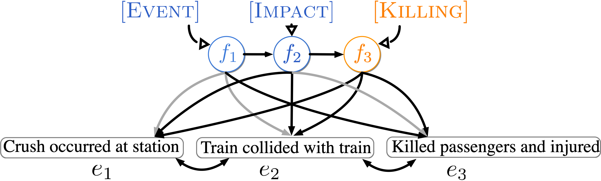

<!--   -->
The implementation of NAACL 2021 paper 
["Event Representation with Sequential, Semi-Supervised Discrete Variables".](https://arxiv.org/pdf/2010.04361.pdf)

 

This Pytorch code implements the model and reproduces the results from the paper.
# Conda Environment:

```
conda create --name ssdvae
conda install pytorch==0.4.1 cuda92 -c pytorch
pip install torchtext==0.2.3
conda install pandas scikit-learn
conda install -c conda-forge pytablewriter
```

# Data:
[Wikipedia Dataset](https://drive.google.com/file/d/1abSJI7Kbm_EaZfZYqTEGocwGVgX4_mBy/view?usp=sharing)

[Wikipedia Inverse Narrative Cloze](https://drive.google.com/file/d/1markcg4CfjJQeKbZ_qtCd17rmhCDO4TH/view?usp=sharing)

[NYT Inverse Narrative Cloze](https://drive.google.com/file/d/1Cjiz2aGdpT9wEHz395VG8bcDEZzjh-4N/view?usp=sharing)


# Training:
```
./train.sh $obsv_prob $exp_num $seed
```

# data_mode:
 {'valid','test'}

# Perplexity:
```
./test_ppx.sh $obsv_prob $exp_num $seed $data_mode
```
# Wiki Inverse Narrative Cloze:
```
./wiki_inv_narr.sh $obsv_prob $exp_num $seed $data_mode
```

# NYT Inverse Narrative Cloze:
```
./nyt_inv_narr.sh $obsv_prob $exp_num $seed $data_mode
```

# Disclaimer
Some parts of the code were inspired by [HAQAE](https://github.com/StonyBrookNLP/HAQAE) implementations.
